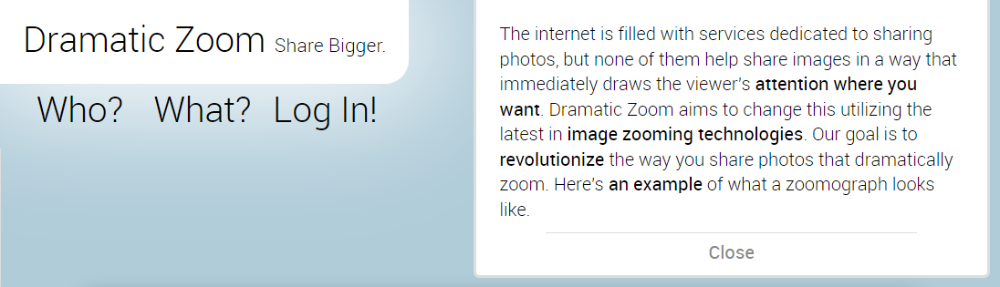
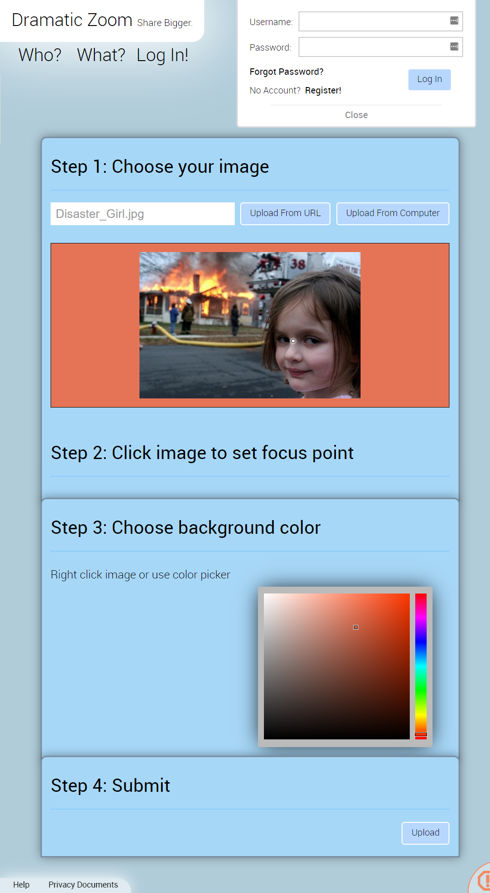

# Dramatic Zoom

The internet is filled with services dedicated to sharing photos, but none of them help share images in a way that immediately draws the viewer's **attention where you want**. Dramatic Zoom aims to change this utilizing the latest in **image zooming technologies**. Our goal is to **revolutionize** the way you share photos that dramatically zoom.

> This website is no longer maintained and the domain no longer resolves. This codebase is kept around but does not build or run.

_Note: This codebase was never fully ported to run with Composer and Bref. It was only ever running on a traditional LAMP stack with a local database on a single host._

---

## About



## Upload



## Zoomograph Example


---

# Building

- Install PHP 7.2
- Install [Composer](https://getcomposer.org), the PHP package mangement tool
- Run `composer install` to generate the `./vendor` folder with all the dependencies.
- Run the build scripts with `composer` in the root of the project.

```
composer build # Build
composer release # Builds and deploys the package
```

# Dependencies

### PHP Lambda Integration

- https://bref.sh
- Lambda layer: arn:aws:lambda:us-east-1:209497400698:layer:php-73:7

# Old docs

Pages
-index.php (contains display and noDisplay)
+noDisplay is the homepage
+display is the page where zoomographs are displayed
-manage.php
-verify.php (email verification)
-reset.php (password reset)

Special Files
-log.txt (Not actually a log file, is the counter that keeps track of the next zoomograph identity. MAKE SURE CONTAINS ONLY A NUMBER)
-redirectClose.php (Facebook wants a page to redirect to after posting, just closes the browser window)
-TODO.txt (what you would expect, my todo list)
-external-image.php (for handling upload from url)
-tempImg.php (for handling images for browsers that don't support FileReader

Resource Files [Ought to be moved to `php/manage-*.php`]
-login.php (handles user credential stuff)
-access.php (handles zoomography stuff)

DEPRECIATED
-temp/
-login.php
-access.php
-loading.gif
